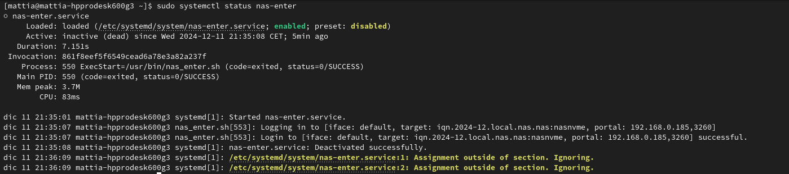

# install-iscsi-service

This script 1 iscsi

Enjoy!



debian base

```sh
sudo apt install open-iscsi git  -y
```

arch base

```sh
sudo pacman -Syu open-iscsi git--noconfirm && sudo systemctl enable --now iscsid.service
```

fedora base

```sh
sudo dnf install open-iscsi git -y
```

